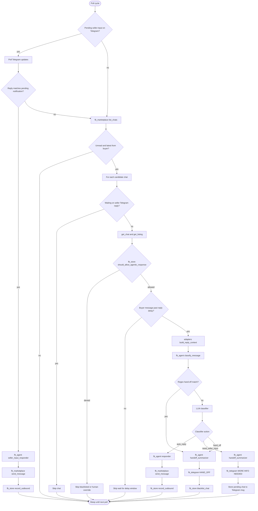

# fb-bot

 &nbsp;&nbsp;&nbsp;&nbsp;This repo is all the code for a system which automates replying to flaky, annoying prospective buyers on Facebook Marketplace. I got sick of having to reply to 50 "Is this still available?" messages every day, so I decided to automate 80% of the process.

 &nbsp;&nbsp;&nbsp;&nbsp;This system uses an LLM with a few subagents to reply to customer questions and negotiate on price before sending me a telegram message once the buyer has proven to be reasonably serious; from then on the bot marks that conversation as done and does not reply anymore, and I can talk meeting details with the buyer.

 &nbsp;&nbsp;&nbsp;&nbsp;This project was proudly vibe coded in about 5 (leisurely) hours. I had a cursor membership left over fomr university so decided to depart from my usual more hands-on programming methodology and gave it a try.
 
 &nbsp;&nbsp;&nbsp;&nbsp;There are quite a few safety considerations I did bake in, such as refusal to answer unrelated questions, prompt injection flagging, and a few others. It also just straight up plays dumb if someone accuses the bot of being an llm.

## Layout at `src/`

The repo is a monorepo of four pip-installable packages, wired together by a thin root layer:

```
src/
  main.py              # CLI entry: config, logging, poll loop bootstrap
  orchestrator.py      # Business flow: poll → gate → classify → act
  adapters.py          # Translate fb_marketplace models → fb_agent models

  fb_marketplace/      # Browser I/O (Playwright)
  fb_store/            # Chat policy + SQLite persistence
  fb_agent/            # LLM classification + reply generation
  fb_telegram/         # Seller notifications + seller-input intake
```

**Root layer responsibilities**

| File | Role |
|------|------|
| `main.py` | Parses flags, loads `.env`, constructs `MarketplaceSession`, `ChatStore`, agent clients, and `BotOrchestrator`. No business rules. |
| `orchestrator.py` | Owns the poll loop and every branch after a buyer message is detected. Calls into the four packages but contains no scraping or prompt logic itself. |
| `adapters.py` | Boundary between extraction types (`ChatDetail`, `ListingDetail`) and agent types (`ReplyContext`). Keeps `fb_agent` free of Playwright imports. |

Packages do not import each other in a circle. Only the root layer composes them.

## Packages and ownership

### `fb_marketplace` — Facebook I/O

Owns everything that touches the browser.

- Persistent Chromium profile (`--user-data-dir`)
- `list_chats`, `get_chat`, `get_listing`, `send_message`
- DOM scraping, URL normalization, relative timestamp parsing
- Internal listing SQLite cache (6h TTL, not part of public API)
- Standalone CLI: `fb-marketplace inbox|chat|listing`

Does **not** know about LLMs, Telegram, or chat policy.

### `fb_store` — Policy and memory

Owns durable chat state in `./data/fb-bot.sqlite`.

- **Blacklist** — chats the bot must never touch again (hand-off, human override)
- **Outbound log** — latest message the bot sent per chat
- **`should_allow_agentic_response()`** — gate before any LLM call:
  - blacklisted → deny
  - latest message not from buyer → deny
  - seller message not matching bot outbound → deny (human took over)
  - otherwise → allow

Does **not** scrape Facebook or call an LLM.

### `fb_agent` — Decision and language

Owns all LLM work. Pure logic + API calls; no browser or DB.

| Component | Purpose |
|-----------|---------|
| `classifier` | Decide: `auto_reply`, `need_seller_input`, or `hand_off` (regex heuristics + LLM) |
| `responder` | Generate buyer-facing auto-reply |
| `seller_input_responder` | Rephrase seller's Telegram answer into a buyer message |
| `handoff_summarizer` | Short Telegram notification for the seller |
| `agent.yaml` | Seller name, pickup area, negotiation bounds |
| `prompts.yaml` | System prompts for each subagent (editable without code changes) |

Does **not** send Facebook messages or Telegram messages directly.

### `fb_telegram` — Seller channel

Owns the Telegram Bot API transport.

- Outbound: `[HAND_OFF]` / `[MORE INFO NEEDED]` alerts with Marketplace chat link
- Inbound: seller replies to a pending notification → orchestrator sends answer to buyer

Does **not** scrape Facebook or run the classifier.

## Message handling flow

Each poll cycle runs **Telegram intake first**, then **Facebook inbox**.



### Branch summary

| Classifier result | What happens |
|-------------------|--------------|
| **auto_reply** | LLM writes a buyer message → sent via Playwright → outbound logged. Chat stays active for future turns. |
| **need_seller_input** | Summarized to Telegram with chat link. Seller replies on Telegram → `seller_input_responder` drafts answer → sent to buyer. Chat stays active; pending state held in orchestrator memory. |
| **hand_off** | Summarized to Telegram with chat link. Chat is **blacklisted** — bot never auto-replies again (pickup scheduling, phone requests, etc.). |

### Human override (implicit branch)

If the seller types directly in the Facebook UI, the next poll sees a seller message that does not match `fb_store` outbound log. `should_allow_agentic_response` denies the chat permanently — same effect as hand-off, without a Telegram notification.

## Configuration surface

| What | Where |
|------|-------|
| Facebook session | Persistent browser profile (`scripts/create_browser_profile.py`) — not `.env` |
| LLM provider / model | `.env` (`LLM_PROVIDER`, `LLM_BASE_URL`, `LLM_API_KEY`, `LLM_MODEL`) |
| Telegram | `.env` (`TELEGRAM_BOT_TOKEN`, `TELEGRAM_CHAT_ID`) — see [src/fb_telegram/TELEGRAM_SETUP.md](src/fb_telegram/TELEGRAM_SETUP.md) |
| Seller persona + negotiation | [src/fb_agent/agent.yaml](src/fb_agent/agent.yaml) |
| Prompts | [src/fb_agent/prompts.yaml](src/fb_agent/prompts.yaml) |
| Chat policy DB | `./data/fb-bot.sqlite` (gitignored) |

## Quick start

```bash
pip install -e ./src/fb_marketplace -e ./src/fb_store -e ./src/fb_agent -e ./src/fb_telegram -e .
playwright install chromium
python scripts/create_browser_profile.py --profile-dir ./.browser-profile
PYTHONPATH=src python -m main --user-data-dir ./.browser-profile --telegram --headful
```

Extraction SDK and CLI details: [src/fb_marketplace/SDK.md](src/fb_marketplace/SDK.md)

Deeper module notes: [plan-modules.md](plan-modules.md)
